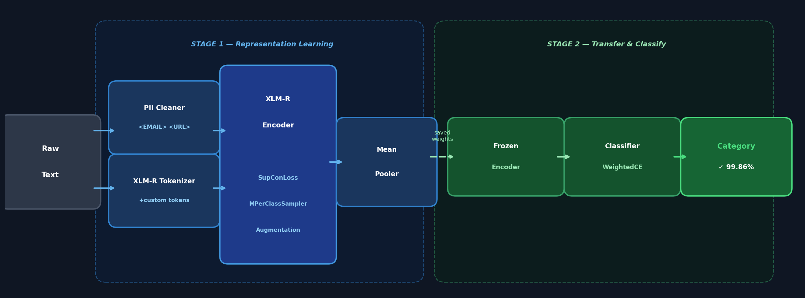
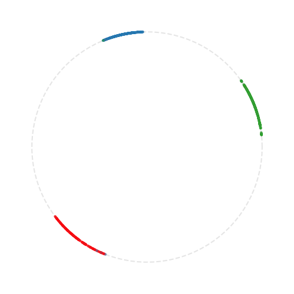
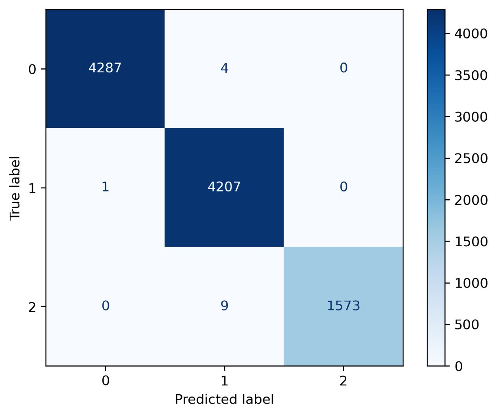

# Multilingual Text Classifier — Supervised Contrastive Learning + Transfer Learning

<p align="center">
  
  
  
  
  
  
</p>

A production-ready, two-stage NLP pipeline for multilingual text classification.
Built on **XLM-RoBERTa** with **Supervised Contrastive Learning** (Khosla et al., NeurIPS 2020) —
validated on **10,081 samples** with **99.86% overall accuracy**.

---

## Results

| Class | Correct | Total | Precision |
|---|---|---|---|
| Class 0 | 4287 | 4291 | **99.9%** |
| Class 1 | 4207 | 4208 | **99.98%** |
| Class 2 *(minority)* | 1573 | 1582 | **99.4%** |
| **Overall** | **10067** | **10081** | **99.86%** |

> Minority class handled via augmentation and class-weighted loss — no class was sacrificed for aggregate accuracy.

---

## Architecture

<p align="center">
  
</p>

The pipeline has two independent training stages:

### Stage 1 — Representation Learning (Contrastive)

Instead of directly fine-tuning for classification, the encoder is trained with **Supervised Contrastive Loss**. The model learns to push embeddings of the same class together and pull different classes apart — forming a geometrically structured, transfer-friendly embedding space.

Key design choices:
- **MPerClassSampler** — M samples per class per batch, stabilizes contrastive training on imbalanced data
- **Minority class augmentation** — underrepresented class repeated K times per batch (`K = max_class_size / minority_size`)
- **Warmup + Cosine Annealing** — 2-step LR warmup, then cosine decay to `η_min = 1e-5`
- **Gradient checkpointing + bfloat16 autocast** — memory-efficient training on 512-token sequences

Metrics logged per step to MLflow: `loss`, `gradient norm`, `alignment`, `uniformity`

### Stage 2 — Transfer & Classification

The pre-trained encoder is loaded, lower layers are frozen, a classification head is attached and trained with **class-weighted Cross-Entropy**. Validation confusion matrix and classification report are saved as MLflow artifacts on every run.

---

## Visualizations

### Learned Embedding Space (UMAP)

<p align="center">
  
</p>

After Stage 1 training, encoder output embeddings are projected to 2D with UMAP and normalized onto the unit circle.
Three tight, well-separated arcs confirm that the model learned a geometrically structured representation —
each class occupies a distinct region of the hypersphere.

This is direct visual confirmation of high **alignment** (tight arcs = intra-class cohesion)
and **uniformity** (arcs spread across the circle = inter-class separation),
as defined in Wang & Isola, ICML 2020.

### Confusion Matrix — Validation Set (10,081 samples)

<p align="center">
  
</p>

Near-perfect diagonal dominance across all three classes, including the minority class.
Only **14 misclassifications** out of 10,081 samples.

---

## Privacy by Design

All text passes through a custom **Cleaner** before tokenization:

| Raw content | Replaced with |
|---|---|
| Email addresses | `<EMAIL>` |
| URLs / links | `<URL>` |
| Usernames / handles | `<USERNAME>` |
| Dates | `<DATE>` |
| Times | `<TIME>` |

These tokens are added to the tokenizer vocabulary and the embedding matrix is resized accordingly.
**No raw PII reaches the model at any stage.**

---

## Project Structure

```
.
├── configs/
│   ├── hyperparams.yaml     # batch_size, lr, epochs, temperature, etc.
│   └── settings.yaml        # paths, device, MLflow tracking URI
├── docs/
│   ├── pipeline_diagram.png # Architecture diagram
│   ├── 025.png              # UMAP embedding visualization
│   └── confusion_matrix.jpg # Evaluation confusion matrix
├── notebooks/
│   ├── supcon-train.ipynb                   # Stage 1: base SupCon training
│   ├── supcon-train-with-augmentatio.ipynb  # Stage 1: with minority augmentation
│   └── interpretation.ipynb                # UMAP visualization of embeddings
├── src/
│   ├── cleaner.py           # PII anonymization
│   ├── collate_fn.py        # Batch collation with tokenizer
│   ├── dataset.py           # PyTorch Dataset
│   ├── evaluation.py        # Embedding extraction for UMAP
│   ├── freezing.py          # Selective layer freezing utilities
│   ├── metrics.py           # Alignment & uniformity (Wang & Isola 2020)
│   ├── model.py             # XLMRoBERTaSupCon + RobertaClassifier
│   ├── pooler.py            # Mean pooling over attention mask
│   ├── settings.py          # YAML config loaders
│   └── training.py          # train_step with AMP + grad clipping
└── requirements.txt
```

---

## Stack

| Component | Library |
|---|---|
| Backbone | `transformers` — XLM-RoBERTa base |
| Contrastive Loss | `pytorch-metric-learning` — SupConLoss |
| Sampling | `pytorch-metric-learning` — MPerClassSampler |
| Visualization | `umap-learn`, `matplotlib` |
| Experiment Tracking | `mlflow` |
| Metrics | `scikit-learn` — classification_report, confusion_matrix |
| Training | `torch` with `autocast` (bfloat16) + gradient checkpointing |
| Config | YAML-driven via custom Pydantic settings |

---

## Scientific Foundation

Every architectural decision in this project is backed by peer-reviewed research.
We track publications on arXiv, Semantic Scholar, and Papers With Code —
and regularly implement, benchmark, and adapt new methods to production constraints.

### [1] Supervised Contrastive Learning
**Khosla et al. · NeurIPS 2020 · [arXiv:2004.11362](https://arxiv.org/abs/2004.11362) · 7,000+ citations**

The core training objective of Stage 1. Unlike cross-entropy fine-tuning, SupCon uses label information
to form tight, semantically meaningful clusters — producing representations that transfer better
and generalize more robustly to unseen distributions.

### [2] XLM-RoBERTa: Unsupervised Cross-lingual Representation Learning at Scale
**Conneau et al. · ACL 2020 · Meta AI Research**

Backbone encoder. Pretrained on 2.5TB of multilingual data across 100 languages —
enabling a single model to handle mixed English/Russian text without separate models or language routing.

### [3] Understanding Contrastive Representation Learning through Alignment and Uniformity
**Wang & Isola · ICML 2020**

Theoretical basis for our training diagnostics. We compute `alignment` (intra-class cohesion)
and `uniformity` (inter-class spread on the unit hypersphere) directly from this paper's formulations
and log them to MLflow per epoch — enabling geometrically-grounded training monitoring.

### [4] pytorch-metric-learning
**Musgrave et al. · 2020 · [GitHub](https://github.com/KevinMusgrave/pytorch-metric-learning)**

Provides `SupConLoss` and `MPerClassSampler`. The M-per-class sampling strategy is critical
for stable contrastive training on imbalanced datasets — ensures equal class exposure per batch.

---

## About

**ShiftLine ML Team** — a research-driven team that builds production AI systems.

Our workflow: literature review → correct implementation → benchmarking → production deployment.

**Expertise:** NLP · Computer Vision · RAG Systems · MLOps · Generative AI · AI Consulting

---

*Available for US market engagement via Upwork*
